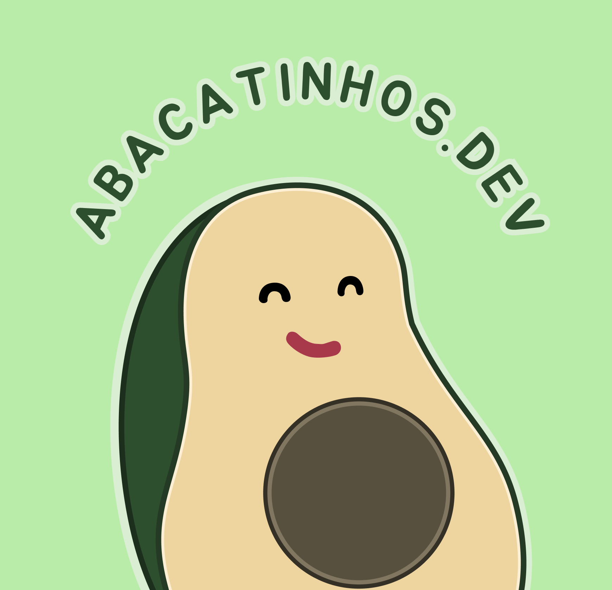

# Abacatinhos.dev



## 📌 Sobre o Projeto

Abacatinhos.dev é uma comunidade brasileira para pessoas interessadas na área de DevRel (Developer Relations) ou que estão começando nela. Nosso objetivo é criar um espaço onde profissionais possam trocar ideias, tirar dúvidas e criar um plano de ação para entrar ou evoluir na área.

Este repositório contém o código-fonte do site oficial da comunidade Abacatinhos.dev.

## 🌐 Site

O site está hospedado no GitHub Pages e pode ser acessado em [abacatinhos.dev](https://abacatinhos.dev).

## 🚀 Tecnologias Utilizadas

- HTML5
- CSS3
- JavaScript (vanilla)
- GitHub Pages para hospedagem

## 🔧 Configuração Local

Para executar o projeto localmente em sua máquina:

1. Clone o repositório:
   ```
   git clone https://github.com/Abacatinhos/abacatinhos.github.io.git
   ```

2. Navegue até o diretório do projeto:
   ```
   cd abacatinhos.github.io
   ```

3. Abra o arquivo `index.html` em seu navegador preferido ou use um servidor local.

## 📂 Estrutura do Projeto

```
├── index.html          # Página principal
├── styles.css          # Estilos CSS
├── CNAME               # Configuração de domínio personalizado
├── favicon.ico         # Ícone do site
├── SECURITY.md         # Política de segurança
├── README.md           # Este arquivo
└── images/             # Diretório de imagens
    ├── logo.png        # Logo da comunidade
    └── pachi-22.jpg    # Foto da mentora
```

## 👥 Como Contribuir

1. Faça um fork do projeto
2. Crie uma branch para sua feature (`git checkout -b feature/nova-funcionalidade`)
3. Faça commit das suas alterações (`git commit -m 'Adiciona nova funcionalidade'`)
4. Faça push para a branch (`git push origin feature/nova-funcionalidade`)
5. Abra um Pull Request

Antes de contribuir, por favor leia nosso [Código de Conduta](https://github.com/Abacatinhos/codigo-de-conduta).


## 📄 Licença

Este projeto está sob a licença MIT. Veja o arquivo LICENSE para mais detalhes.
---

Feito com 💚 pela comunidade Abacatinhos.dev